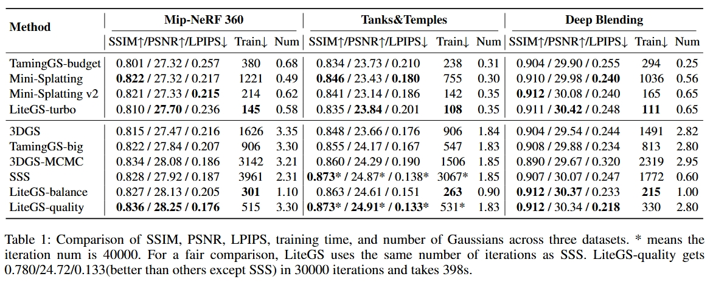
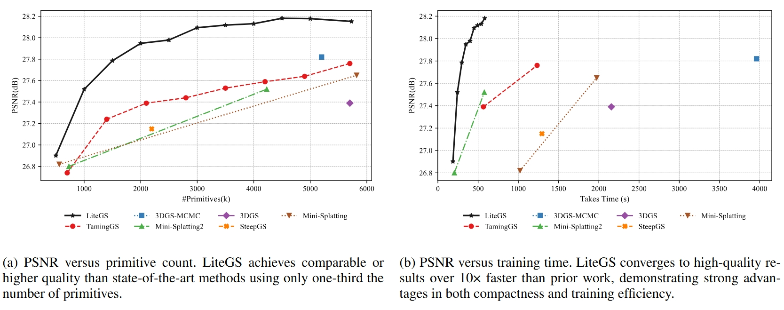

# LiteGS

**The Fastest Operators! 4.7x Acceleration, Modular, and Available in Pure Python or CUDA**

This repository provides a refactored codebase aimed at improving the flexibility and performance of Gaussian splatting. 

## What's New

* Warp-based raster algorithm minimizes reduce operations
* Optimal patchsize derived from algorithm and hardware resources to minimize atomic additions on global memory
* fp16 accelerated raster
* Ampere architecture-accelerated reduction instructions (requires sm_8.x or higher)
* Depth support temporarily removed (half-precision raster impact on depth not yet tested; use stable branch if needed)

We're excited to release a preview of LiteGS's latest advancements, achieving 30%-35% speedup over the previous version. Compared to the original 3DGS implementation, LiteGS delivers 4.7x acceleration, making it the fastest 3DGS operator to our knowledge. ​​Note:​​ The preview version has not yet completed adaptation for older GPU architectures - ensure your device is sm_8.x or higher, otherwise use the stable branch. Technical details will be presented in an upcoming paper/report. Thank you for your interest.

## Roadmap
* [Done] Incorporate latest point cloud density control techniques (tentatively TamingGS's Score-based Densification)
* Restore depth support

## Background
Gaussian splatting is a powerful technique used in various computer graphics and vision applications. It involves representing 3D data as Gaussian distributions in space, allowing for efficient and accurate representation of spatial data. However, the original implementation (https://github.com/graphdeco-inria/gaussian-splatting) of Gaussian splatting in PyTorch faced several limitations: 

1. The forward and backward computations were encapsulated in two distinct PyTorch extension functions. Although this design significantly accelerated training, it restricted access to intermediate variables unless the underlying C code was modified.
2. Modifying any step of the algorithm required manually deriving gradient formulas and implementing them in the backward pass, adding considerable complexity.

## Features

1. **Modular Design**: The refactored codebase breaks forward and backward into multiple PyTorch extension functions, significantly improving modularity and enabling easier access to intermediate variables. Additionally, in some cases, leveraging PyTorch Autograd eliminates the need to manually derive gradient formulas.

2. **Flexible**: LiteGS provides two modular APIs—one implemented in CUDA and the other in Python. The Python-based API facilitates straightforward modifications to calculation logic without requiring expertise in C code, enabling rapid prototyping. Additionally, tensor dimensions are permuted to maintain competitive training speeds for the Python API. For performance-critical tasks, the CUDA-based API is fully customizable.

3. **Better Performance and Fewer Resources**: LiteGS achieves an 4.7x speed improvement over the original 3DGS implementation while reducing GPU memory usage by around 30%. These optimizations enhance training efficiency without compromising flexibility or readability.

4. **Algorithm Preservation**: LiteGS retains the core 3DGS algorithm, making only minor adjustments to the training logic due to culstering.


## Getting Started

1. Clone

    ```bash
    git clone --recursive https://github.com/MooreThreads/LiteGS.git
    cd LiteGS
    ```

2. Install simple-knn

    ```bash
    cd litegs/submodules/simple-knn
    python install .
    ```

3. Install fused-ssim

    ```bash
    cd litegs/submodules/fussed_ssim
    python intsall .
    ```
    

4. Install litegs_fused
    
    ```bash
    cd litegs/submodules/gaussian_raster
    python install .
    ```

    If you need the cmake project(e.g. CUDA Debug in Visual Studio)：

    ```bash
    cd litegs/submodules/gaussian_raster
    mkdir ./build
    cd ./build
    #for Windows PowerShell: $env:CMAKE_PREFIX_PATH = (python -c "import torch; print(torch.utils.cmake_prefix_path)")
    export CMAKE_PREFIX_PATH=$(python -c "import torch; print(torch.utils.cmake_prefix_path)")
    cmake ../
    cmake --build . --config Release
    ```

    
### Train
Begin training with the following command:

`./example_train.py --sh_degree 3 -s DATA_SOURCE -i IMAGE_FOLDER -m OUTPUT_PATH`

## Faster

The training results of LiteGS using the Mip-NeRF 360 dataset on an RTX 3090 are presented below. The training and evaluation command used is:

LiteGS-turbo:
`python ./scripts/full_eval_fast.py --mipnerf360 SOURCE_PATH1 --tanksandtemples SOURCE_PATH2 --deepblending SOURCE_PATH3`

LiteGS:
`python ./full_eval.py --mipnerf360 SOURCE_PATH1 --tanksandtemples SOURCE_PATH2 --deepblending SOURCE_PATH3`






## Modular

Unlike the original 3DGS, which encapsulates nearly the entire rendering process into a single PyTorch extension function, LiteGS divides the process into multiple modular functions. This design allows users to access intermediate variables and integrate custom computation logic using Python scripts, eliminating the need to modify C code. The rendering process in LiteGS is broken down into the following steps:

1. Cluster Culling
    
    LiteGS divides the Gaussian points into several chunks, with each chunk containing 1,024 points. The first step in the rendering pipeline is frustum culling, where points outside the camera's view are filtered out.

2. Cluster Compact
    
    Similar to mesh rendering, LiteGS compacts visible primitives after frustum culling. Each property of the visible points is reorganized into sequential memory to improve processing efficiency.

3. 3DGS Projection
    
    Gaussian points are projected into screen space in this step, with no modifications made compared to the original 3DGS implementation.

4. Create Visibility Table
    
    A visibility table is created in this step, mapping tiles to their visible primitives, enabling efficient parallel processing in subsequent stages.

5. Rasterization
    
    In the final step, each tile rasterizes its visible primitives in parallel, ensuring high computational efficiency.

LiteGS makes slight adjustments to density control to accommodate its clustering-based approach. 

## Flexible

The gaussian_splatting/wrapper.py file contains two sets of APIs, offering flexibility in choosing between Python-based and CUDA-based implementations. The Python-based API is invoked using call_script(), while the CUDA-based API is available via call_fused(). While the CUDA-based API delivers significant performance improvements, it lacks the flexibility. The choice between these implementations depends on the specific use case:

* python-based api: Provides greater flexibility, making it ideal for rapid prototyping and development where training speed is less critical.

* cuda-based api: Offers the highest performance and is recommended for production environments where training speed is a priority.

Additionally, an interface validate() and the accompanying check_wrapper.py script are provided to verify that both APIs produce consistent gradients.

Here is an example that demonstrates the flexibility of LiteGS. In this instance, our goal is to create a more precise bounding box for a 2D Gaussian when generating visibility tables. In the original 3DGS implementation, the bounding box is determined as three times the length of the major axis of the Gaussian. However, incorporating opacity can allow for a smaller bounding box.

To implement this change in the original 3DGS, the following steps are required:
* Modify the C++ function declarations and definitions
* Update the CUDA global function
* Recompile

In LiteGS, the same change can be achieved by simply editing a Python script.

original:
```python
axis_length=(3.0*eigen_val.abs()).sqrt().ceil()
```
modified:
```python
coefficient=2*((255*opacity).log())
axis_length=(coefficient*eigen_val.abs()).sqrt().ceil()
```

## Citation

If you find this project useful in your research, please consider cite:

```
@misc{liao2025litegshighperformanceframeworktrain,
      title={LiteGS: A High-performance Framework to Train 3DGS in Subminutes via System and Algorithm Codesign}, 
      author={Kaimin Liao and Hua Wang and Zhi Chen and Luchao Wang and Yaohua Tang},
      year={2025},
      eprint={2503.01199},
      archivePrefix={arXiv},
      primaryClass={cs.CV},
      url={https://arxiv.org/abs/2503.01199}, 
}
```

## Performance Optimization Detail

Comming soon.