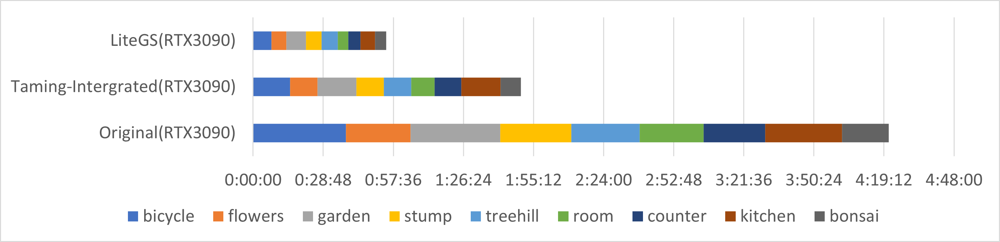

# LiteGS

**80% Faster!!  Modular!!  Pure Python or CUDA Extension**

Welcome to this repository, which houses a refactored codebase designed to enhance the flexibility and performance of Gaussian splatting.

## Background
Gaussian splatting is a powerful technique used in various computer graphics and vision applications. It involves mapping a set of points onto a grid using Gaussian distributions, allowing for efficient and accurate representation of spatial data. However, the original implementation (https://github.com/graphdeco-inria/gaussian-splatting) of Gaussian splatting in PyTorch posed certain challenges: 

1. Both the forward and backward passes were encapsulated within a single PyTorch extension function, making it difficult to access intermediate variables without delving into the C code.
2. Even if one attempted to modify the C code, they would have to derive the gradient formula manually and subsequently implement those formulas in the backward pass.

## Features

1. **Modular Design**: The refactored Gaussian splatting implementation separates the forward and backward into multiple PyTorch extension functions, promoting greater modularity and ease of access intermediate data. Besides, by leveraging PyTorch Autograd, the refactored codebase eliminates the need for deriving the gradient formula manually.

2. **Flexible**: PytorchGS offers two sets of modular APIs. One is implemented in CUDA, while the other is purely Python-based. You can easily modify the calculation logic in the Python API without delving into C code, allowing for rapid prototyping of your ideas. Moreover, we’ve carefully designed the GPU memory layout to ensure the Python API maintains reasonable training speeds. For performance enthusiasts, the CUDA-implemented API is also available for modification.

3. **Better Performance and Fewer Resources**: LiteGS not only surpasses the original 3DGS code in terms of flexibility and readability but also achieves a significant speedup of 80%. Our optimizations have been focused on enhancing training performance while reducing GPU memory usage.

4. **no-new**: We’ve preserved the original 3DGS algorithm, with only minor training logic adjustments due to the BVH creation.


## Getting Started

### build and install submodules.

To get started, you’ll need to install the required submodules:

1. Install simple-knn

    `cd gaussian_splatting/submodules/simple-knn`

    `python setup.py build_ext --inplace -j8`

    `python setup.py install`

2. Install gaussian_raster

    `cd gaussian_splatting/submodules/gaussian_raster`

    `mkdir ./build`

    `cd ./build`

    `cmake -DCMAKE_PREFIX_PATH=@1/share/cmake ../` replace @1 with the installation path of your PyTorch, which is like "\$PYTHONHOME\$/Lib/site-packages/torch"

    `cmake --build . --config Release`

### train

Begin training with the following command:

`./train.py --random_background --sh_degree 0 -s dataset/garden -i images_4 -m output/garden`

## Faster

The metrics is highly relay on the colmap result. we using the processed data same as the RetinaGS( https://github.com/MooreThreads/RetinaGS ).

The traininig result of LiteGS with mipnerf360 datasets in NVIDIA A100 is shown as below. The training and eval command is `python ./full_eval.py --mipnerf360 SOURCE_PATH`

|  metric\|scene    |Bicycle  |flowers  |garden   |stump    |treehill |room     |counter  |kitchen  |bonsai   |
|   ----     | ---     | ---     | ---     | ---     | ---     | ---     | ---     | ---     | ---     |
|SSIM(Test)  | 0.764   | 0.612   | 0.858   | 0.787   | 0.637   | 0.919   | 0.906   | 0.920   | 0.940   |
|PSNR(Test)  | 25.454  | 22.038  | 27.622  | 27.174  | 22.768  | 32.027  | 29.307  | 32.100  | 33.073  |
|LPIPS(Test) | 0.218   | 0.335   | 0.112   | 0.218   | 0.318   | 0.186   | 0.179   | 0.113   | 0.166   |


The metrics of original 3DGS is shown as below for comparison. The metrics demonstrate that our refactored code does not compromise accuracy.

|metric\|scene  |Bicycle  |flowers  |garden   |stump    |treehill |room     |counter  |kitchen  |bonsai   |
|   ----     | ---     | ---     | ---     | ---     | ---     | ---     | ---     | ---     | ---     |
|SSIM(Test)  | 0.770   | 0.623   | 0.866   | 0.771   | 0.641   | 0.931   | 0.919   | 0.933   | 0.950   |
|PSNR(Test)  | 25.33  | 21.85  | 27.58  | 26.74  | 22.46  | 31.93  | 29.54  | 31.52  | 33.10  |
|LPIPS(Test) | 0.200   | 0.320   | 0.107   | 0.223   | 0.317   | 0.220   | 0.204   | 0.129   | 0.205   |


The cost of training on NVIDIA A100 is shown as below, illustrating the approximately **80% speedup** achieved by LiteGS.

| repo\|scene  |Bicycle  |flowers  |garden   |stump    |treehill |room     |counter  |kitchen  |bonsai   |
|   ----     | ---     | ---     | ---     | ---     | ---     | ---     | ---     | ---     | ---     |
| Original(d9fad7b) | 32:09   | 24:37   | 31:34   | 25:58   | 24:08   | 21:59   | 21:45   | 25:41   | 19:10   |
| LiteGS | 17:19   | 13:45   | 17:24   | 16:56   | 15:26   | 9:31   | 9:40   | 10:34   | 10:02   |



## Modular

In contrast to the original 3DGS, which encapsulates almost the entire rendering process into a single torch extension function, LiteGS divides the rendering process into several functions. Users can access intermediate variables and insert compute logic with Python scripts instead of modifying C code. LiteGS breaks down the rendering into the following steps:

1. Cluster Culling
    
    LiteGS devide the gaussian points into servel chunks and each chunk include 1024 points. The first step of rendering is the frustum culling. 

2. Cluster Compact
    
    Similar to mesh rendering, LiteGS compacts visible primitives after frustum culling. Specifically, it compacts each property of Gaussian points into sequential memory.

3. 3DGS Projection
    
    This step projects Gaussian points into screen space, with no changes from the original version.

4. Create Visibility Table
    
    The forth step is creating the visibility table which maps the tile and its visible primitives.

5. Rasterization
    
    The final step is rasterization. Each tile rasterize its visible primitives in parallel.

Due to LiteGS’s clustering of point clouds, density control requires a new implementation. LiteGS clones and splits points each epoch, clustering them into new chunks without rebuilding the BVH. The opacity of points is reset and invalid points are removed every 10 epochs, followed by BVH rebuilding. The opacity reset frequency in LiteGS is faster than in original 3DGS, so we opt for decaying opacity instead of resetting it close to zero.

## Flexible

Inside `gaussian_splatting/wrapper.py`, there are two sets of GS function. Functions with the “v1” suffix are implemented in Python, while those with the “v2” suffix are implemented as CUDA extensions. The CUDA extensions offer significant performance improvements but lack the flexibility of Python. The choice between the two implementations depends on the specific use case:

* PythonScript: Offers greater flexibility. It is suitable for rapid prototyping and development where the training speed is not critical.

* CudaExtension: Provides the highest performance and is recommended for production environments where training speed is of utmost importance.

To switch between the two implementations, simply modify the `gaussian_splatting/wrapper.py` file

Here is an example that demonstrates the flexibility of LiteGS. In this instance, our goal is to create a more precise bounding box for a 2D Gaussian when generating visibility tables. In the original 3DGS, the bounding box for the 2D Gaussian is set to three times the length of the major axis. However, this coefficient can be reduced if opacity is taken into account.

Let’s attempt to implement this change in the original 3DGS. The tasks to be completed are as follows:
* Modify the C++ functions, including both declarations and definitions.
* Modify the CUDA global function.
* Compile

In contrast, with LiteGS, only the Python scripts need to be altered.

original:
```python
axis_length=(3.0*eigen_val.abs()).sqrt().ceil()
```
modified:
```python
coefficient=2*((255*opacity).log())
axis_length=(coefficient*eigen_val.abs()).sqrt().ceil()
```

## Citation

If you find this project useful in your research, please consider cite:

```
@misc{LiteGS,
    title={LiteGS},
    author={LiteGS Contributors},
    howpublished = {\url{https://sh-code.mthreads.com/ai/Pytorch-GaussianSplatting}},
    year={2024}
}
```

## Performance Optimization Log

In this section, we detail the key optimizations implemented at each stage mentioned earlier.

### high level

At a high level, We **restructured the memory layout**. The dimension  order of tensors are altered from [points,property] to [property,points]. After this changing, the tensor computation implemented by pure python will load and store sequencially.

### DensityControl

**A simple BVH** is build for density control. In contrast to the original implementation, where new points are appended to the end of tensors, leading to decreasing spatial locality, our approach maintains it.

### Cull and Compact

The original implementation culls primitives directly, which can be time-consuming in large scenes. We optimized this by performing **frustum culling** on cluster AABBs (Axis-Aligned Bounding Boxes) instead.

Beside, we **compact** the parameters of gaussian points which improve the gpu utilization.  The original implementation skips calculations for culled Gaussian points but the gpu schedule instruction in wrap(32 threads).

An important note is that compaction should be applied to Gaussian point clusters. Applying it to primitives can slow down the backward pass due to out-of-order writes.

### Projection

The projection step has nothing changed with original implements. We highly recommend you to using the cuda implemented function instead of the prue python function. The essential different between these two functions is whether we write the intermediate data into the gpu global memory. Projection step contain servel consecutive 4x4 matmul. Writing the inermediate data into gpu global memory will significantly enlarge data transfer overhead.

### Create Visibility Table

Same as the "binning" step in compute raster, the purpose of this step is mapping the gaussian points and tiles. The key of this step is create a more accurate bounding box for each primitive. An accurate visibility table will reduce computation. Original 3DGS use the long axis of 2D gaussian to create a bounding square. It is rough. **Taking the transparency and short axis into consideration**, LiteGS create a accurate bounding box of 2D gaussian.

We have to trade off the accuracy for speed. The bounding box composed of long-axis and short-axis need 2 pass to create the visibility table. One pass for the allocate size and One pass for filling the table. 2D AABB is easy to get the allocate size so it only need one pass. LiteGS choose to using 2D AABB.

### Rasterization

There is a large efficiency problem in original implementation. During the backward pass of rasterization, the gradient of properties is calculated for each pixel and these gradient need to be summed. The original implementation directly uses AtomicAdd.

A more efficient implementation is the reduction algorithm, which many repositories have already adopted. Here is an example of the code:

```
for(int i=element_num;i > 16;i/=2)
{
    if(threadidx.x < i)
    {
        property0[threadidx.x]+=property0[threadidx.x+i];
        property1[threadidx.x]+=property1[threadidx.x+i];
        property2[threadidx.x]+=property2[threadidx.x+i];
        ...
        __syncthreads();
    }
}  
float grad0=property0[threadidx.x];
float grad1=property1[threadidx.x];
...
for(int i=16;i > 0;i/=2)
{
    grad0 += __shfl_down_sync(0xffffffff, grad0, i);
    grad1 += __shfl_down_sync(0xffffffff, grad1, i);
    ...
} 
```

The backward pass of rasterizing the 2D Gaussian plane is the most time-consuming step in the entire training process, and it is necessary to pay more attention to it.

#### Warp-level reduction
In some situations, skipping the reduction in shared memory and directly using Warp-level reduction followed by atomicadd is the best implementation. Specifically, if we have enough ROP units on device, the reduction on shared memory is not necessary. ROP unit is a haredware architecture in L2 cache to accelerate the atomic operation in NVIDIA gpu(Maybe some prue compute card will not have rop unit, but there must be some haredware unit resbonsible for global atomic operation. For brevity, we still use ROP units to refer to these hardware units). If there are enough ROP units, the atomicadd operation will not be the bottleneck. The key is the ratio between the compute units and ROP units. For example, Nvidia Turing architecture containing 36 SMs and 96 ROP units while Nvidia Ampere architecture containing 84 SMs and 112 ROP units.

In a word, warp-level reduction is a simple implementation and takes good performance. For some devices, it is the best choice.

#### multibatch reduction
For the reduction in shared memory, there are many optimizations. Each pixel contain 9 float type variable as gradient which means that we are not doing a simple reduction but a multibatch reduction. Assigning threads to multiple batches instead of for-loop batches can greatly speed up reudction.
```
for (int property_id = threadidx / 32; property_id < property_num ; property_id+= wraps_num_in_block)
{
    float gradient_sum = 0;
    for (int offset = threadid_in_warp; offset < tilesize * tilesize; reduction_i+=32)
    {
        gradient_sum += gradient_buffer[property_id * tilesize * tilesize + offset];
    }
    for (int offset = 16; offset > 0; offset /= 2)
    {
        gradient_sum += __shfl_down_sync(0xffffffff, gradient_sum, offset);
    }
    if (threadid_in_warp == 0)
    {
        shared_gradient_sum[property_id] = gradient_sum;
    }
}
```

Besides, the empty fragment is a big problem. We create a list of visible primitives in current tile however the visible primitives may not fill the entire tile. Some primitive create a lot of empty fragments. Using a smaller tilesize can reduce this sideeffect but it increase the task size in sort stage. From our testing, change the tilesize from 16x16 to 8x8 is beneficial.

Compacting the gradient in shared memory and skipping the empty fragments in gradient summation is a further solution. Compacting the valid fragments and store the gradient in shared memory. After a block synchronize, sum the gradients in shared memory. The code is followed.
```
__shared__ float gradient[9][tilesize*tilesize];
__shared__ int valid_pix_num;
for(point:points)
{
    float alpha=CalcAlpha(threadIdx.xy,point);
    if(alpha>1.0f/255)
    {
        int index=AtomicAdd(&valid_pix_num);
        GradientPack grad_pack=CalcGradient(point);
        gradient[0][index]=grad_pack.ndc[0];
        gradient[1][index]=grad_pack.ndc[1];
        gradient[2][index]=grad_pack.cov_inv[0][0];
        gradient[3][index]=grad_pack.cov_inv[0][1];
        gradient[4][index]=grad_pack.cov_inv[1][1];
        gradient[5][index]=grad_pack.rgb[0];
        gradient[6][index]=grad_pack.rgb[1];
        gradient[7][index]=grad_pack.rgb[2];
        gradient[8][index]=grad_pack.alpha;
    }
}
__syncthreads();
MultibatchSum(gradient);
```
